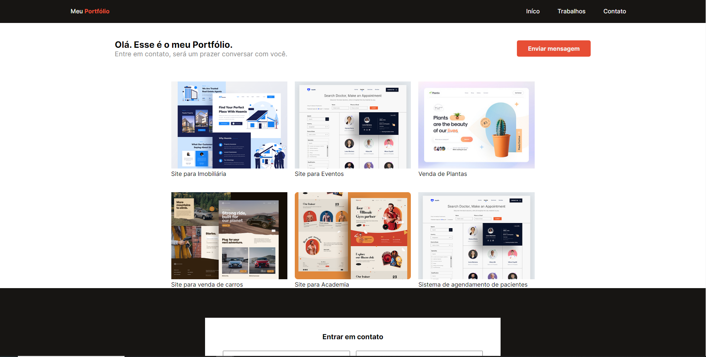

# Explorer-Classroom-Portfolio-main

- Projeto - Nivel 02-  03 - Reforçando a Responsividade

> Nivel 02 - 03 - Reforçando a Responsividade

👉🏼[Link do projeto](https://explorer-classroom-portfolio-main.vercel.app/)

## 5 ferramentas para dominar  para desenvolver qualquer aplicação responsivas

1. Utilização de Porcentagem (%) para trabalhar com larguras de forma dinamica e imagens

2. Fontes responsivas (em) e (rem)

3. Flexbox para posicionamentos dos elementos responsivos sem utilizar necesariamente unidade de medida

4. Grid para definir a estrutura da minha pagina

5. Media Querys para definir os pontos de quebra de nosso layout 

#  💻🔧 Tecnologias

- HTML
- CSS
- Git
- Git Hub

## Contato 💻

juniorjose1925@gmail.com

https://www.linkedin.com/in/jose-martinez-352032222/
